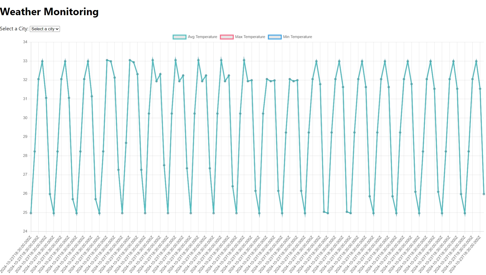
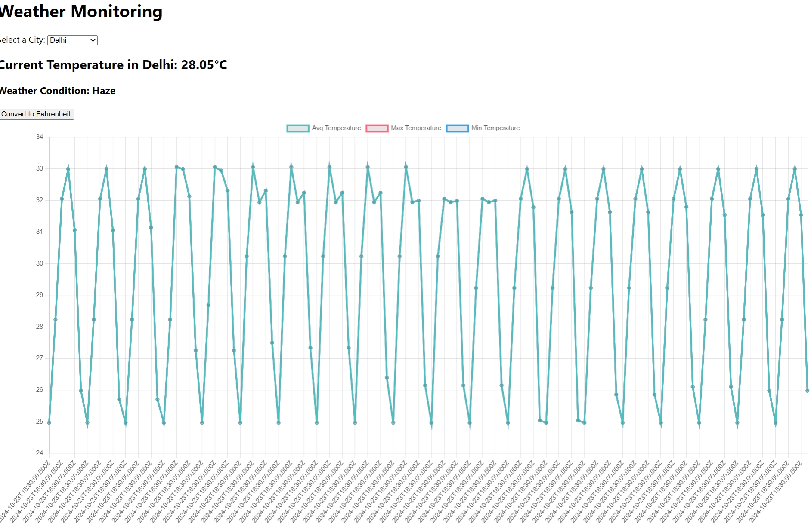

# Weather Monitoring and Alert System
This project is a Weather Monitoring and Alert System that fetches real-time weather data for several cities, stores the data in a MySQL database, and triggers email alerts when weather conditions exceed specified thresholds.

**Features**
* Fetches weather data for major cities using the OpenWeatherMap API.
* Stores daily weather summaries (average temperature, max/min temperature, dominant weather condition) in a MySQL database.
* Triggers email alerts when temperature exceeds a threshold for two consecutive days.
* Provides an API endpoint to fetch weather summaries.
* Automates weather data collection and alert checks every 5 minutes.

**Technologies Used**
* Node.js and Express for the backend.
* MySQL for storing weather data.
* Axios for making HTTP requests to the OpenWeatherMap API.
* Nodemailer for sending email alerts.
* dotenv for environment variable management.
* Cors for cross-origin requests.

**Prerequisites**
Ensure you have the following installed on your system:

* Node.js (v14 or higher)
* npm (Node Package Manager)
* MySQL database

**Setup**
1. Clone the Repository
```javascript
git clone https://github.com/your-repo/weather-alert-system.git
cd weather-alert-system
```
1. Install Dependencies
```javascript
npm install
```
1. Create a `.env` File
Create a .env file in the root of the project and add the following environment variables:
```javascript
DB_HOST=your_db_host
DB_USER=your_db_user
DB_PASSWORD=your_db_password
DB_NAME=your_db_name

OPENWEATHER_API_KEY=your_openweathermap_api_key
EMAIL_USER=your_email@gmail.com
EMAIL_PASS=your_email_password
ALERT_EMAIL=recipient_email@gmail.com
```
4. Set Up MySQL Database
Create a MySQL database and run the following SQL queries to create the necessary tables:
```javascript
CREATE TABLE weather_summary (
    id INT AUTO_INCREMENT PRIMARY KEY,
    city VARCHAR(100),
    date DATE,
    avg_temp FLOAT,
    max_temp FLOAT,
    min_temp FLOAT,
    dominant_condition VARCHAR(100)
);

CREATE TABLE alerts (
    id INT AUTO_INCREMENT PRIMARY KEY,
    alert_message TEXT,
    city VARCHAR(100),
    alert_date TIMESTAMP DEFAULT CURRENT_TIMESTAMP
);
```
1. Start the Server
Run the following command to start the server:
```javascript
node index.js
```
The server will start on http://localhost:5000.

1. Schedule Weather Data Processing
The system is configured to fetch weather data and check for alerts every 5 minutes. This is done using setInterval in the code:
```javascript
setInterval(() => {
    processWeatherData();
    checkForAlerts();
}, 300000); // 5 minutes in milliseconds
```
**API Endpoints**
1. Get Weather Summary
* Endpoint: /api/weather-summary
* Method: GET
* Description: Fetches all weather summaries stored in the MySQL database.
* Response: Array of weather summaries with city, date, average temperature, max/min temperature, and dominant weather condition.
```javascript
[
    {
        "id": 1,
        "city": "Delhi",
        "date": "2023-10-15",
        "avg_temp": 34.5,
        "max_temp": 36.7,
        "min_temp": 32.1,
        "dominant_condition": "Clear"
    },
    {
        "id": 2,
        "city": "Mumbai",
        "date": "2023-10-15",
        "avg_temp": 29.3,
        "max_temp": 31.0,
        "min_temp": 28.1,
        "dominant_condition": "Clouds"
    }
]
```
**How the System Works**
1. Fetch Weather Data
The application fetches real-time weather data for predefined cities (Delhi, Mumbai, Chennai, Bangalore, Kolkata, and Hyderabad) using the OpenWeatherMap API. It collects information about temperature, weather conditions, and the date of data collection.

1. Store Weather Data
The fetched data is processed and stored in the weather_summary table of the MySQL database. The average, maximum, and minimum temperatures, as well as the dominant weather condition, are stored for each city.

1. Check for Alerts
The system checks if the temperature in any city exceeds a specified threshold (e.g., 35°C) for two consecutive days. If this condition is met, an alert is triggered, and an email is sent to the specified recipient.

1. Send Alerts
The system uses Nodemailer to send email alerts if the conditions for an alert are met. Alerts are stored in the alerts table for record-keeping.

***Customization***
You can easily customize the system by:

* Adding more cities: Update the cities array to include more cities.
* Changing the alert threshold: Modify the thresholdTemp variable to set a different temperature threshold.
* Changing the alert frequency: Adjust the time interval in setInterval for more frequent or less frequent checks.
**License**
This project is open-source and available for modification or use under the terms of the MIT License.
* With this setup, you can monitor weather conditions and receive timely alerts for any unusual temperature spikes in the listed cities

# Frontend

* As soon as we run the server, we can see the following page:

* This project is a Weather Monitoring Dashboard that displays real-time weather information and temperature trends for selected cities. The dashboard fetches data from a weather API, processes it, and presents it visually using charts.

**Features**
* City selection: Users can select a city from the dropdown to see the current temperature and weather condition.
* Temperature trends: Displays average, maximum, and minimum temperature trends over time in a line chart.
* Real-time updates: Fetches and displays the current temperature and weather condition for the selected city.
* Unit conversion: Provides a button to convert the temperature from Celsius to Fahrenheit.

**Key Components**
1. City Dropdown: Allows the user to select a city from a predefined list.
1. Current Weather Information:
* Displays the current temperature and weather condition (e.g., haze, clear, rain).
* Updates based on the selected city.
1. Temperature Trends Chart:
* Line chart showing the trend of average, maximum, and minimum temperatures for the selected city over time.
* Data is presented visually with a legend showing which line represents which temperature metric.

**Technology Stack**
* Frontend: The dashboard is likely built using HTML, CSS, and JavaScript.
* The line chart is probably generated using a JavaScript charting library such as Chart.js or D3.js.
* Backend: The data is fetched from a backend API that connects to the OpenWeatherMap API or another weather service to retrieve real-time data.
* API: Weather data is retrieved from an external weather service using an API (e.g., OpenWeatherMap API).
**How to Use**
1. Select a city from the dropdown at the top of the dashboard.
1. The current temperature and weather condition will be displayed below the dropdown.
1. View the temperature trends in the line chart:
* The x-axis represents time.
* The y-axis represents temperature in degrees Celsius (default).
1. Click on the "Convert to Fahrenheit" button to toggle between Celsius and Fahrenheit.

**Example Display**
In the screenshot:

* The selected city is Delhi.
* The current temperature is 28.05°C.
* The weather condition is "Haze."
* The line chart below shows average, maximum, and minimum temperature trends over time.


**Prerequisites**
To run this project locally or in your environment, ensure you have:

* Node.js and npm installed (for backend services if applicable).
* API key from OpenWeatherMap or another weather API service.

**Setup and Installation**
1. Clone the Repository
```javascript
git clone https://github.com/your-username/weather-monitoring-dashboard.git
cd weather-monitoring-dashboard
```
1. Install Dependencies
If using a Node.js backend for fetching weather data:
```javascript
npm install
```
1. Create an `.env` file
Create a .env file in the root directory with your weather API credentials:
```javascript
OPENWEATHER_API_KEY=your_api_key_here
```
1. Run the Application
To start the server (if applicable):
```javascript
npm start
```
* To view the dashboard, open index.html in your browser.

**Conclusion**
This Weather Monitoring Dashboard provides a real-time, visual representation of weather conditions and temperature trends for various cities. The ability to select cities and toggle between Celsius and Fahrenheit makes it interactive and user-friendly. The line chart helps users easily understand temperature patterns over time.


